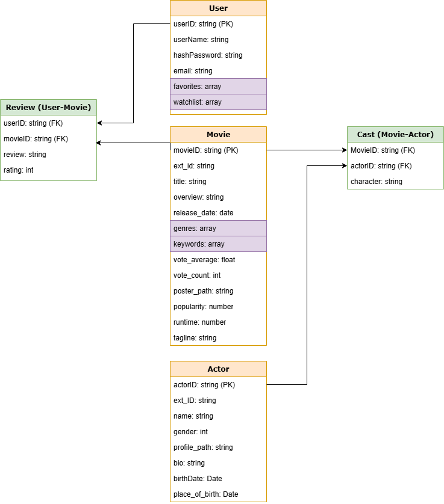

# 🎬 CineScope – Your Personalized Movie Discovery Platform

CineScope is a user-friendly movie search platform designed to help users explore a rich collection of films from The Movie Database (TMDB). It enables user engagement through features like reviews, ratings, comments, and personalized watchlists. The app is focused exclusively on movies, ensuring tailored recommendations based on each user's favorites and watchlist history. Users can also discover trending and popular films, keeping them up to date with the latest in cinema.

---

## 🚀 Getting Started

- 📋 **Planning Materials**: [Trello Board](https://trello.com/b/s2nfFmT1/project3)
- 💻 **GitHub Repository (Full Stack)**: [GitHub - CineScope](https://github.com/AnnWL/project3)

---

## 🙌 Attributions

- [TMDB API](https://www.themoviedb.org/documentation/api) – for movie, cast, and crew data

---

## 🛠 Technologies Used

### Front-End

- JavaScript
- HTML
- CSS
- React

### Back-End

- Node.js
- Express.js
- express-validator

### Database

- MongoDB with Mongoose

---

## 📈 Next Steps

- Implement ElasticSearch for more powerful and flexible search queries
- Develop a personalized recommendation engine based on user activity
- Include crew data (e.g. directors, writers) in profiles and film details
- Enhance database structure and indexing to improve scalability and performance
  - e.g. indexing common query fields like `title`, `userId`, and `movieId`
  - optimizing schema for faster read/write operations under high traffic

---

---

## 🧩 Data Schema Overview

This schema supports key features such as reviews, watchlists, user favorites, cast details, and TMDB data integration.

